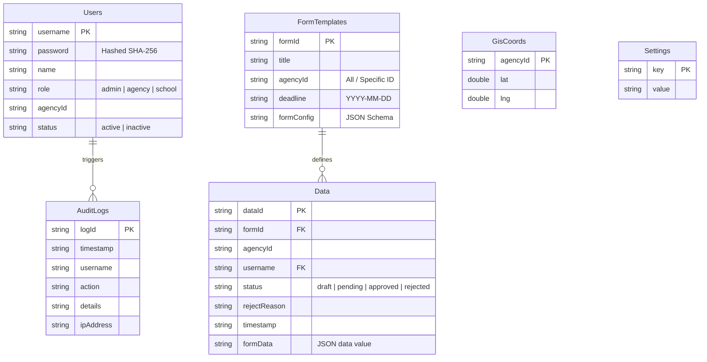

# คู่มือการใช้งานระบบสำหรับผู้ดูแลระบบ (Admin User Manual)
## ระบบสารสนเทศการจัดเก็บข้อมูลการศึกษาภาพรวมจังหวัดสกลนคร (EduData Sakon — Enterprise Edition)
### เอกสารคู่มือปฏิบัติการอย่างละเอียดระดับสูงสุด (Comprehensive Operations Manual) — Version 3.0.0

---

## สารบัญ (Table of Contents)
1. **ภาพรวมระบบและสถาปัตยกรรมข้อมูล (System Architecture & Database)**
2. **ระบบรักษาความปลอดภัยและการจัดการเซสชัน (Security & Session Heartbeat)**
3. **แดชบอร์ดควบคุมสถานการณ์ (Live "War Room" Dashboard & Interactive GIS Map)**
4. **ระบบกำกับติดตามและหน่วยทวงถามข้อมูลอัจฉริยะ (Monitoring Matrix & AI Auto-Dunning Agent)**
5. **ระบบสร้างแบบฟอร์มและจัดการข้อมูล (Form Builder Wizard & CSV Dynamic Template)**
6. **ระบบสร้างแดชบอร์ดอัจฉริยะ (Conversational BI Builder & Drag-and-Drop Canvas)**
7. **ระบบจัดเตรียมเอกสารนโยบายและส่งต่อผู้บริหาร (AI Executive Briefing Pack Generator)**
8. **ระบบซ้อนทับชั้นข้อมูลและการปักหมุดเชิงพื้นที่ (GIS Overlays & Interactive Pinning Helpers)**
9. **ศูนย์ควบคุมความปลอดภัยสูงสุด (Super Admin Console Operations)**

---

## 📂 1. ภาพรวมระบบและสถาปัตยกรรมข้อมูล (System Architecture & Database)

ระบบ **EduData Sakon** พัฒนาขึ้นโดยใช้สถาปัตยกรรมแบบ Serverless บนแพลตฟอร์ม **Google Workspace (Google Apps Script - GAS)** โดยไม่มีค่าใช้จ่ายรายเดือนด้านคลาวด์และโฮสติ้ง แต่มีประสิทธิภาพในการรองรับการส่งข้อมูลและการวิเคราะห์ผลระดับสูงสำหรับองค์กรขนาดกลางและหน่วยงานการศึกษารวมไม่เกิน 20 สังกัด

### 📊 แผนผังความเชื่อมโยงข้อมูล (Data Flow & Architecture)
ข้อมูลในระบบทั้งหมดจัดเก็บอยู่บน **Google Sheets** ซึ่งทำหน้าที่เป็นฐานข้อมูลเชิงสัมพันธ์ (Relational Database) มี 6 ตาราง/ชีตย่อย ดังนี้:

1.  **Users (ตารางผู้ใช้งาน):** จัดเก็บข้อมูลบัญชีผู้ใช้ สิทธิ์ และรหัสผ่านที่ผ่านการเข้ารหัสด้วย SHA-256 ป้องกันความปลอดภัยระดับองค์กร
2.  **Settings (ตารางตั้งค่า):** เก็บข้อมูลการตั้งค่าระบบหลัก เช่น ปีการศึกษาปัจจุบัน รอบการเปิด-ปิดระบบ
3.  **FormTemplates (ตารางแม่แบบแบบฟอร์ม):** จัดเก็บข้อมูลโครงสร้างแบบฟอร์มที่แอดมินสร้างขึ้น โดยเก็บฟิลด์ในรูปแบบ JSON Schema
4.  **Data (ตารางข้อมูลรายงาน):** จัดเก็บข้อมูลสถิติจริงที่นำส่งจากทุกสถานศึกษา โดยเก็บข้อมูลคำตอบในลักษณะ Dynamic JSON String ช่วยให้ระบบยืดหยุ่นสูง รองรับฟิลด์ที่ต่างกันในแต่ละฟอร์มได้
5.  **AuditLogs (ตารางบันทึกกิจกรรม):** จัดเก็บประวัติทุกกิจกรรม เช่น การนำส่ง การอนุมัติ การดาวน์โหลด เพื่อใช้สำหรับงานตรวจสอบย้อนกลับ (Traceability)
6.  **GisCoords (ตารางพิกัดภูมิศาสตร์):** เก็บพิกัดจุดตั้งสำนักงานเพื่อใช้พลอตบนแผนที่นำเสนอ

---

## 🔒 2. ระบบรักษาความปลอดภัยและการจัดการเซสชัน (Security & Session Heartbeat)

ระบบถูกออกแบบมาให้ปลอดภัยตามหลักเกณฑ์ควบคุมสิทธิ์และการประสานข้อมูลระดับสูง:

### 2.1 สิทธิ์ผู้ใช้งานระบบ (User Roles)
*   **Super Admin / Admin (ศึกษาธิการจังหวัด):** เข้าถึงได้ทุกฟังก์ชัน ทำหน้าที่สร้างแบบฟอร์ม ตรวจสอบระบบ อนุมัติ/ส่งคืนข้อมูล จัดการบัญชีผู้ใช้ ดู Audit Logs และจัดการพิกัด
*   **Agency Admin (สพป./สพม./ท้องถิ่น/อาชีวะ):** มองเห็นรายงานและสามารถกำกับติดตามเฉพาะโรงเรียนย่อยภายใต้สังกัดตนเองเท่านั้น
*   **School / Sub-agency User (โรงเรียน/หน่วยงานระดับล่าง):** ทำหน้าที่กรอกข้อมูลรายปี นำเข้าไฟล์ CSV ดาวน์โหลดเทมเพลต และดูแบบร่างของตนเอง ไม่มีสิทธิ์เข้าถึงหน้าควบคุมอื่นๆ

### 2.2 กลไก Concurrency Control (ระบบล็อกข้อมูลชนกัน)
เมื่อมีการนำส่งรายงานพร้อมกันในช่วงเดดไลน์ ระบบหลังบ้านจะเรียกใช้งาน `LockService.getScriptLock()` เพื่อทำการต่อคิว (Queue) บันทึกข้อมูลลงชีต ป้องกันการเขียนข้อมูลทับซ้อนหรือไฟล์ชีตพังเสียหาย

### 2.3 ระบบต่ออายุการทำงาน (Session Heartbeat)
*   **หลักการทำงาน:** ค่า Token ของการล็อกอินจะถูกบันทึกใน `CacheService` ของ Google มีอายุสูงสุด 2 ชั่วโมง 
*   **Session Heartbeat:** โค้ดในฝั่งหน้ากากหน้าจอ (Frontend) จะทำการส่งคำสั่งเรียกใช้ฟังก์ชัน `refreshSession()` ไปยังคลาวด์ทุกๆ 25 นาทีอัตโนมัติ เพื่อต่ออายุของ Session Token ใน Cache ออกไปอีก 2 ชั่วโมง ทำให้ผู้ใช้ที่เปิดหน้าต่างทำงานค้างไว้จะไม่ถูกเตะออกกลางคันโดยไม่ตั้งใจ

---

## 📊 3. แดชบอร์ดควบคุมสถานการณ์ (Live "War Room" Dashboard & Interactive GIS Map)

หน้าแดชบอร์ดหลักทำหน้าที่เป็น "War Room" สำหรับสรุปข้อมูลเชิงสถิติและการจัดทำแผนที่สารสนเทศภูมิศาสตร์เชิงพื้นที่แบบเรียลไทม์

### 3.1 บอร์ดสรุปยอดรวม (Summary Cards & Counter Animation)
เมื่อเปิดหน้า Dashboard ระบบจะดึงยอดรวมที่อนุมัติแล้วมาคำนวณและแสดงผลในการ์ดสรุป 4 ประเภทหลัก:
1.  **จำนวนสถานศึกษาทั้งหมด (แห่ง)**
2.  **จำนวนผู้เรียนทั้งหมด (คน)**
3.  **จำนวนครูและบุคลากรทางการศึกษา (คน)**
4.  **ผู้เรียนที่มีความต้องการพิเศษ (คน)**
*ตัวเลขหลักหมื่นจะใช้อนิเมชันเลื่อนจำนวนขึ้นอย่างรวดเร็ว (Animated Count) สร้างความพรีเมียมให้การนำเสนอข้อมูล*

### 3.2 บอร์ดจัดอันดับรายงานความสำเร็จ (Gamified Leaderboard Panel)
แผงด้านข้างแผนที่จะทำหน้าที่จัดอันดับความร่วมมือในการนำส่งรายงานของทั้ง 13 สังกัดตามสัดส่วนร้อยละ (%) แบบเรียลไทม์:
*   **เหรียญรางวัลเกียรติยศ:** อันดับ 1 (ทอง 🥇), อันดับ 2 (เงิน 🥈), อันดับ 3 (ทองแดง 🥉) เพื่อกระตุ้นและสร้างความร่วมมือเชิงบวกให้แก่ทุกสังกัด
*   **แถบความคืบหน้า (Progress Bar):** แสดงขีดวัดตามสัดส่วนการรายงานจริง

### 3.3 แผนที่เรดาร์พิกัด (Interactive Leaflet Map & Silent Reload Sync)
*   **การซิงก์สองทิศทาง:**
    - เมื่อผู้ใช้ **คลิกเลือกจุดบนแผนที่** และกดปุ่ม *"แสดงข้อมูลสังกัดนี้"* ระบบจะไปเปลี่ยนตัวกรอง Dropdown หลักบนแดชบอร์ด และรีโหลดตัวเลขสถิติ กราฟวงกลม และกราฟ ECharts สถิติจริงทั้งหน้าจอให้เปลี่ยนตามในทันทีโดยไม่ต้องรีเฟรชหน้าเว็บ (Silent Auto-Reload)
    - เมื่อผู้ใช้ **คลิกที่ชื่อหน่วยงานบน Leaderboard** แผนที่จะหันความสนใจและซูม (Pan & Zoom) เข้าไปยังมาร์กเกอร์พิกัดของสำนักงานนั้นทันที
*   **ปุ่ม Reset:** กดปุ่มหมุนรีเซ็ตตัวกรอง **"ทั้งหมด"** บนบอร์ด Leaderboard เพื่อดึงแดชบอร์ดหลักกลับมาแสดงยอดรวมของทั้งจังหวัดสกลนคร

---

## 📈 4. ระบบกำกับติดตามและหน่วยทวงถามข้อมูลอัจฉริยะ (Monitoring Matrix & AI Auto-Dunning Agent)

ช่วยผู้ดูแลระบบในการติดตามว่ามีโรงเรียนหรือหน่วยงานย่อยใดบ้างที่ยังค้างส่งแบบฟอร์ม หรือส่งข้อมูลกลับมาแล้วแต่ถูกผู้ดูแลระบบตีกลับให้แก้ไขใหม่

### 4.1 ตารางสถานะรายงานภาพรวม (Monitoring Grid Matrix)
ตารางความก้าวหน้ารายฟอร์มและรายสังกัดจะแยกสีแสดงความคืบหน้าดังนี้:
*   🟢 **สีเขียว (อนุมัติแล้ว - Approved):** ข้อมูลถูกต้องผ่านเกณฑ์นำเข้าเรียบร้อย
*   🔵 **สีฟ้า (รออนุมัติ - Pending):** โรงเรียนนำส่งมาแล้ว รอแอดมินจังหวัดเข้ามาตรวจข้อมูล
*   🟠 **สีส้ม (ส่งกลับแก้ไข - Rejected):** ข้อมูลไม่ผ่านเกณฑ์ ถูกตีกลับให้แก้
*   🔴 **สีแดง (ค้างส่ง - Missing/Draft):** ยังไม่มีการรายงานข้อมูล หรือค้างอยู่ในสถานะร่าง

### 4.2 ระบบทวงถามงานค้างส่งด้วย AI (AI Auto-Dunning Email Assistant)
หากมีหน่วยงานค้างส่ง แอดมินสามารถกดปุ่ม "ทวงถามด้วย AI" ที่รายชื่อสังกัดที่ยังส่งข้อมูลไม่ครบ:
1.  **คลิกปุ่มทวงถาม:** คลิกที่ปุ่มสีม่วงพิเศษ ✨ **"ทวงงานด้วย AI"** ข้างแถวสังกัดที่ส่งข้อมูลไม่ครบ
2.  **AI ประมวลผลและดึงอีเมลติดต่อ:** ระบบจะไปดึงอีเมลติดต่อของเจ้าหน้าที่สังกัดนั้นๆ ในชีต `Users` อัตโนมัติ พร้อมส่งรายการแบบฟอร์มที่ค้างส่งไปให้ Gemini AI ร่างอีเมลราชการภาษาไทยที่เป็นทางการ สุภาพ แต่หนักแน่น และระบุชื่อแอดมินปลายทางโดยเฉพาะ
3.  **กล่องจดหมายตรวจทาน (Draft Edit Panel):** หน้าต่าง Modal สีม่วงจะปรากฏขึ้นเพื่อให้แอดมินตรวจทานเนื้อหา อีเมลผู้รับ และหัวข้อจดหมาย โดยแอดมินสามารถลบ แก้ไข หรือพิมพ์ข้อความเพิ่มเติมได้โดยอิสระ
4.  **คลิกเดียวส่งจริง:** เมื่อเรียบร้อยแล้วกดปุ่ม **"ส่งอีเมลทวงถามข้อมูล"** ระบบจะส่งจดหมาย HTML ตกแต่งแถบสีเรียบร้อย เข้าสู่กล่องจดหมายผู้รับปลายทางทันทีผ่านบริการ Mail ของ Google

---

## 🛠️ 5. ระบบสร้างแบบฟอร์มและจัดการข้อมูล (Form Builder Wizard & CSV Dynamic Template)

ผู้ดูแลระบบสามารถจัดการสร้าง แก้ไข และกำหนดระยะเวลาส่งรายงานสำหรับทุกหน่วยงาน

### 5.1 ระบบสร้างฟอร์มอย่างง่าย (Form Builder Wizard)
เข้าเมนู **สร้างแบบฟอร์มใหม่** เพื่อระบุคุณสมบัติฟอร์ม:
*   กำหนดชื่อแบบฟอร์มและคำอธิบาย
*   เลือกสังกัดเป้าหมายที่จะรายงาน (สามารถกำหนดให้ส่งทุกสังกัด หรือเฉพาะสังกัดใดสังกัดหนึ่ง)
*   กำหนดวันสิ้นสุดการรับรายงาน (Deadline Date)
*   **Visual Form Wizard:** กดปุ่ม **เพิ่มฟิลด์คำถาม** เพื่อกำหนดประเภทของข้อมูลที่ต้องการจัดเก็บ:
    - *ข้อความสั้น / ข้อความยาว* (สำหรับชื่อ หรือคำอธิบาย)
    - *ตัวเลข* (ระบบรองรับการคำนวณสถิติ เช่น จำนวนคน, จำนวนบาท)
    - *ตัวเลือกดรอปดาวน์ / ตัวเลือกเช็กบ็อกซ์ / ตัวเลือกเรดิโอ* (สำหรับข้อมูลบังคับเลือก)
*   กดบันทึกเพื่อเผยแพร่ฟอร์มเข้าสู่ฐานข้อมูล `FormTemplates` ทันที

### 5.2 ปุ่มดาวน์โหลดและใช้งานเทมเพลต CSV ไดนามิก (Dynamic CSV Template Engine)
*   **สำหรับผู้รายงาน:** เมื่อผู้รายงานคลิกเลือกฟอร์มที่ต้องกรอก ปุ่มดาวน์โหลด **"ดาวน์โหลดเทมเพลต CSV"** สีเขียวจะปรากฏขึ้นข้างปุ่มนำเข้า
*   **ความถูกต้องภาษาไทย 100%:** ระบบจะสร้างไฟล์เทมเพลต CSV ไดนามิกตามชื่อฟอร์มนั้นๆ และดึงเอาคอลัมน์คำถามมาเรียงเป็นหัวตาราง พร้อมใส่ **UTF-8 Byte Order Mark (BOM - `\ufeff`)** เข้าไปที่ต้นไฟล์ ทำให้เมื่อผู้ใช้นำไปเปิดในโปรแกรม **Microsoft Excel ภาษาไทย จะแสดงภาษาไทยถูกต้องทั้งหมดทันที** ไม่ติดปัญหาภาษาต่างดาว (Mangled characters)
*   **ระบบนำเข้า (CSV Import Parser):** เมื่อกรอกข้อมูลเสร็จแล้วนำมาอัปโหลดผ่านปุ่ม **"นำเข้าไฟล์ CSV"** ระบบจะแกะข้อมูลไปหยอดใส่ลงในช่องข้อมูลบนฟอร์มบนหน้าจอให้อัตโนมัติ เพื่อให้ผู้ใช้ตรวจทานอีกครั้งก่อนกดนำส่งข้อมูลจริง

---

## 🎨 6. ระบบสร้างแดชบอร์ดอัจฉริยะ (Conversational BI Builder & Drag-and-Drop Canvas)

เมนู **BI Dashboard Builder** เปิดโอกาสให้ผู้บริหารและแอดมินจัดวางหน้าแดชบอร์ดสถิติวิเคราะห์เชิงลึกได้ด้วยตนเองโดยไม่ต้องเขียนโค้ดแม้แต่บรรทัดเดียว

### 6.1 แถบคำสั่งเสียง/ภาษาไทยอัจฉริยะ (Conversational BI AI Assistant)
ด้านบนสุดของหน้า BI Builder จะมีแถบสีกราเดียนท์ม่วง-น้ำเงินดีไซน์เรียบหรูสไตล์ AI:
1.  **พิมพ์สั่งงานได้ทันที:** ผู้ดูแลระบบสามารถระบุความต้องการในการจัดทำแผนภูมิวิเคราะห์สถิติเป็นภาษาไทยธรรมดา เช่น:
    - *"ขอกราฟแท่งแสดงจำนวนครูเปรียบเทียบในสังกัดเอกชนกับอาชีวศึกษา"*
    - *"ทำกราฟวงกลมสรุปจำนวนนักเรียนพิการแยกจำแนกโรค"*
    - *"ขอกราฟเส้นเปรียบเทียบแนวโน้มงบประมาณประจำปี"*
2.  **การแปลงคำสั่งเป็น Widget (Gemini Chart Parsing):** ระบบจะส่งข้อความไปหา Gemini AI ร่วมกับข้อมูลโครงสร้างคอลัมน์และเทมเพลตที่มีอยู่ทั้งหมด AI จะตีความและตอบกลับออกมาเป็นรูปแบบ **JSON Widget Schema** โครงสร้างที่ถูกต้อง
3.  **สร้างอัตโนมัติใน Canvas:** ระบบจะสร้างการ์ดกราฟ Widget (ECharts) พร้อมสไตล์สีสัน Hex-Color สวยงามและข้อมูลสถิติจริงจากฐานข้อมูลลงมาวางไว้บนแคนวาสทันที

### 6.2 การควบคุมและจัดการ Widget ด้วยตนเอง (Canvas Controls)
*   **เพิ่ม Widget ด้วยตนเอง:** แอดมินสามารถกดปุ่มสีฟ้า **"เพิ่ม Widget"** เลือกขนาด แหล่งข้อมูล และประเภทกราฟ (Bar, Line, Pie, Radar, Scatter, Mixed Chart) ได้ตามใจชอบ
*   **โหมดสลับปรับแต่ง (Preview vs Edit mode):** 
    - *โหมด Edit:* สามารถลากขยายขอบกว้าง-ยาว หรือคลิกย้ายตำแหน่งการ์ด (Drag & Drop) ได้อย่างอิสระ
    - *โหมด Preview:* การ์ดจะถูกตรึงตำแหน่งไว้และแสดงหน้าตาจริงสำหรับใช้นำเสนอรายงาน
*   **การส่งออกข้อมูล:**
    - **ปุ่ม PDF:** สั่งพิมพ์หน้าแดชบอร์ดที่สร้างขึ้นเป็นเล่มรายงาน PDF โดยระบบจะซ่อนแถบคำสั่งและควบคุมให้อย่างสมบูรณ์แบบ
    - **ปุ่ม บันทึก:** บันทึกโครงสร้างหน้าแดชบอร์ดที่แอดมินลากวางจัดสไตล์นี้ลงในอุปกรณ์ (LocalStorage) เพื่อใช้เปิดในการล็อกอินครั้งต่อไป

---

## 📄 7. ระบบจัดเตรียมเอกสารนโยบายและส่งต่อผู้บริหาร (AI Executive Briefing Pack Generator)

ช่วยเปลี่ยนข้อมูลตัวเลขแห้งๆ และสรุปสั้นๆ ให้กลายเป็นเล่มเอกสารนำเสนอระดับจังหวัดสไตล์พรีเมียมที่จัดหน้าสำหรับพิมพ์ลงกระดาษ A4 หรือเซฟเป็น PDF ได้ในคลิกเดียว

### 7.1 ขั้นตอนการจัดทำเล่มรายงานผู้บริหาร
1.  **AI สรุปข้อมูลเชิงนโยบาย:** บนหน้าแดชบอร์ดหลัก กดปุ่ม 🪄 **"AI สรุป"** (สรุปเชิงนโยบายด้วย AI)
2.  **ปุ่มเข้าใช้เครื่องมือจัดทำเล่ม:** เมื่อบอทเขียนสรุปสถิติจำแนกเรียบร้อย จะปรากฏปุ่มสีม่วงอ่อนเขียนว่า **"เล่มรายงานสรุปผู้บริหาร"** ให้คลิกปุ่มนี้
3.  **การแปลงกราฟหน้าจอเป็นรูปภาพ (Canvas Capture):** ระบบจะดึงแผนภูมิ ECharts สถิติจริงที่แสดงบนหน้าจอของผู้ใช้ขณะนั้น มาแปลงค่าเป็นรูปภาพเข้ารหัส Base64 (PNG รูปภาพคุณภาพสูง 2 เท่า) โดยอัตโนมัติ เพื่อนำไปจัดหน้าคู่กับรายงาน
4.  **แท็บนำเสนอรายงานระดับสูง (Briefing Popup Window):** ระบบจะเปิดแท็บหน้าต่างเบราว์เซอร์ใหม่ เป็นเทมเพลตรวมเอกสาร A4 แนวตั้งประกอบด้วย 2 หน้าหลัก:
    - **หน้า 1: ปกและสรุป AI** -> หน้าปกสีกราเดียนท์ (Gradient Cover) ระบุวันเวลาและชื่อจังหวัดอย่างเป็นทางการ พร้อมหัวข้อการวิเคราะห์และสรุปเชิงนโยบาย 5 มิติจาก Gemini API อย่างครบถ้วนจัดเรียงในฟอนต์ "Sarabun" ที่อ่านง่ายสบายตา
    - **หน้า 2: สถิติและแผนภูมิภาพ** -> บอร์ดแสดงการ์ดตัวชี้วัด KPI สำคัญ 4 ด้านพร้อมกล่องล้อมกรอบสีพรีเมียม และแผนภาพกราฟ ECharts ของสถิติจริงจังหวัด 4 ด้านหลักที่แปลงเป็นรูปภาพฝังตัวอยู่ในหน้านี้

### 7.2 ช่องทางนำส่งรายงาน
*   **พิมพ์ / บันทึก PDF:** กดปุ่ม **"🖨️ พิมพ์ / บันทึก PDF"** สีม่วง แถบปุ่มควบคุมการสั่งงานจะซ่อนตัว และเปิดกล่องพิมพ์ของ Windows ทันที พร้อมจัดหน้าลง A4 สวยงามพอดีกระดาษ 100%
*   **ส่งอีเมลหาผู้บริหารปลายทาง:** กดปุ่ม **"✉️ ส่งอีเมลถึงผู้บริหาร"** ระบุอีเมลปลายทาง (เช่น อีเมลของผู้ว่าราชการจังหวัด หรือศึกษาธิการจังหวัด) และกดส่ง ระบบจะจัดรูปจดหมายอีเมล HTML ที่นำตัวบทสรุปและกราฟรูปภาพทั้งหมดเข้าเลย์เอาต์หรูหรานำส่งเข้าสู่กล่องจดหมายผู้บริหารปลายทางทันทีผ่านบริการ Mail ของ Google

---

## 🗺️ 8. ระบบซ้อนทับชั้นข้อมูลและการปักหมุดเชิงพื้นที่ (GIS Overlays & Interactive Pinning Helpers)

ยกระดับแผนที่ GIS จากเดิมที่บอกตำแหน่งสำนักงานธรรมดา ให้กลายเป็นระบบแผนที่ซ้อนทับข้อมูลการวิเคราะห์เชิงลึก (Spatial Overlays) เพื่อช่วยชี้เป้าปัญหาการจัดการศึกษาในสกลนคร

### 8.1 การวิเคราะห์สลับเลเยอร์แผนที่ (Choropleth/Bubble Overlays)
ที่ dropdown ขวาบนของกล่องแผนที่เรดาร์หลัก สามารถคลิกเพื่อสลับโหมดแผนที่นำเสนอได้ 3 มิติ:
1.  **📍 พิกัดสำนักงานสังกัด (Standard Pins Layer):** แสดงตำแหน่งที่ตั้งจริงของแต่ละสังกัด
    - *มาร์กเกอร์สีน้ำเงิน:* มีการนำส่งรายงานเรียบร้อยแล้ว
    - *มาร์กเกอร์สีเทา:* ค้างส่งรายงานประจำปี
2.  **🟣 ความหนาแน่นผู้เรียน (Student Density Bubble Map):** 
    - แผนที่จะเปลี่ยนจากหมุดไอคอนมาแสดงผลในรูปแบบวงกลมโปร่งแสงสีรุ้ง (Bubble Layer)
    - ขนาดรัศมีของวงกลมจะแปรผันตามจำนวนสัดส่วนจำนวนนักเรียนทั้งหมดในแต่ละหน่วยงาน (คำนวณรัศมีแบบ Dynamic Square Root ป้องกันปัญหาวงกลมล้นจอภาพ)
    - สีวงกลมเปลี่ยนตามเกณฑ์: *สีแดง* (> 10,000 คน), *สีเหลือง* (2,000 - 10,000 คน), *สีเขียว* (< 2,000 คน)
3.  **🚨 สัดส่วนนักเรียนต่อครู (Shortage Alert Overlay):**
    - วิเคราะห์สัดส่วนอัตรากำลังครูเชิงพื้นที่เพื่อหาตำแหน่งที่ขาดแคลนครู (Teacher Shortages)
    - แสดงวงกลมไล่สีตามสัดส่วน นักเรียน : ครู 1 คน:
      - 🔴 **สีแดง (ขาดแคลนมาก):** ครู 1 คน แบกรับนักเรียนมากกว่า 25 คนขึ้นไป
      - 🟡 **สีเหลือง (ปานกลาง):** ครู 1 คน ดูแลนักเรียนระหว่าง 15 - 25 คน
      - 🟢 **สีเขียว (เพียงพอ):** ครู 1 คน ดูแลนักเรียนน้อยกว่า 15 คน
      - ⚪ **สีเทา:** ไม่มีข้อมูลการส่งรายงานที่ได้รับอนุมัติในรอบปีการศึกษานั้นๆ
*แผงคำอธิบาย Legend Panel แสดงระดับเกณฑ์สีสันและรายละเอียดสเกลจะปรากฏขึ้นที่ขวาล่างของแผนที่โดยเปลี่ยนตามเลเยอร์ที่สลับอัตโนมัติ*

### 8.2 เครื่องมือปักหมุดแผนที่ย่อย (Click-to-Pin Interactive Mini Map)
ในฐานะ Admin เมื่อเปิดหน้าแก้ไขพิกัดในตาราง Master Data ของแต่ละสังกัด ระบบจะมีกลไกปักหมุดสีแดงช่วยเหลืออย่างสะดวกสบาย:
1.  **ปุ่มช่วยหาพิกัดอัตโนมัติ (OSM Geocoding):** คลิกปุ่มสีเขียว **"ค้นหาพิกัดอัตโนมัติ"** ระบบจะส่งชื่อหน่วยงานไปสอบถามพิกัดละติจูดและลองจิจูดจาก API แผนที่สากลโดยตรง หากพบคอมพิวเตอร์จะกรอกเลขพิกัดทศนิยม 6 ตำแหน่งลงฟิลด์ทันที
2.  **ปุ่มปักหมุดจริง (Interactive Mini Map):** หากค้นหาไม่พบ หรือต้องการความแม่นยำสูง คลิกปุ่มสีฟ้า **"ปักหมุดบนแผนที่ย่อย"**
    - แผงแผนที่ย่อยของจังหวัดสกลนครจะแสดงผลขึ้นมาในกล่อง Modal
    - แอดมินสามารถลาก เลื่อน ซูมหาจุดแลนด์มาร์ก และทำการ **คลิกหรือดับเบิลคลิกตรงตำแหน่งจริงบนแผนที่**
    - หมุดมาร์กเกอร์สีแดงจะแสดงตำแหน่ง พร้อมดึงค่าละติจูดลองจิจูดล่าสุดมาแสดงให้เห็นมุมขวาล่าง และแอดมินสามารถใช้นิ้วลากหมุดแดงขยับต่อได้
    - เมื่อได้จุดที่แม่นยำ กดปุ่ม **"ยืนยันพิกัดนี้"** ระบบจะนำข้อมูลพิกัดมาเขียนลงในกล่องข้อความกรอกของหน้าจัดการหลัก จากนั้นแอดมินเพียงกดปุ่ม **"บันทึกพิกัด"** เพื่อจัดเก็บบันทึกลง Google Sheets และอัปเดต markers ทั้งระบบทันที

---

## ⚙️ 9. ศูนย์ควบคุมความปลอดภัยสูงสุด (Super Admin Console Operations)

หน้า **ศูนย์ควบคุมระบบ (Admin Console)** เป็นศูนย์กลางคำสั่งสำหรับการบริหารงานหลังบ้านโดยตรงของศึกษาธิการจังหวัดสกลนคร

### 9.1 การจัดการบัญชีผู้ใช้งาน (User Management)
*   คลิกที่การ์ด **"จัดการผู้ใช้งาน"**
*   **สร้างผู้ใช้ใหม่:** กรอกชื่อผู้ใช้, ชื่อจริง, สิทธิ์ใช้งาน (Admin / Agency / School), เลือกสังกัด และกำหนดรหัสผ่านเบื้องต้น
*   **ปิดสิทธิ์ชั่วคราว:** ในตารางผู้ใช้ แอดมินสามารถคลิกปุ่มสลับสถานะ (Toggle) บัญชีจาก `Active` เป็น `Inactive` เพื่อยกเลิกสิทธิ์เข้าถึงระบบของพนักงานรายนั้นได้ทันทีโดยไม่ต้องลบบัญชีออก
*   **รีเซ็ตรหัสผ่าน:** กดปุ่ม **"รีเซ็ตรหัสผ่าน"** พิมพ์รหัสผ่านใหม่ยืนยันความยาว 8 ตัวขึ้นไปเพื่ออัปเดตรหัสผ่านใหม่ลงระบบความปลอดภัยทันที

### 9.2 การตรวจประวัติเหตุการณ์ (Audit Log & Session Log View)
*   **Audit Log:** ใช้สำหรับตรวจสอบกิจกรรมในระบบ เช่น ดึงข้อมูลว่าใครเป็นคนกดยกเลิกแบบฟอร์ม ส่งแบบร่าง หรืออนุมัติรายงานเมื่อวันและเวลาใด
*   **Session Log:** ดูประวัติประทับเวลา (Timestamp) การล็อกอินเข้าและออกจากระบบของผู้ใช้งานแต่ละหน่วยงาน เพื่อความปลอดภัยสูงสุดทางไซเบอร์ของข้อมูลระบบราชการ

### 9.3 การสลับปีการศึกษาและการจัดรอบส่งรายงาน (Term Cycle Control)
*   ใช้เมื่อต้องการปิดรับสถิติปีเก่าและเริ่มเก็บสถิติปีการศึกษาใหม่
*   แอดมินสามารถเลือกปีการศึกษาหลัก และกดปุ่มล้าง/เริ่มต้นเพื่ออัปเดตชีตตั้งค่า `Settings` เพื่อประกาศเดดไลน์ใหม่สำหรับฟอร์มประจำปีอย่างครอบคลุม
